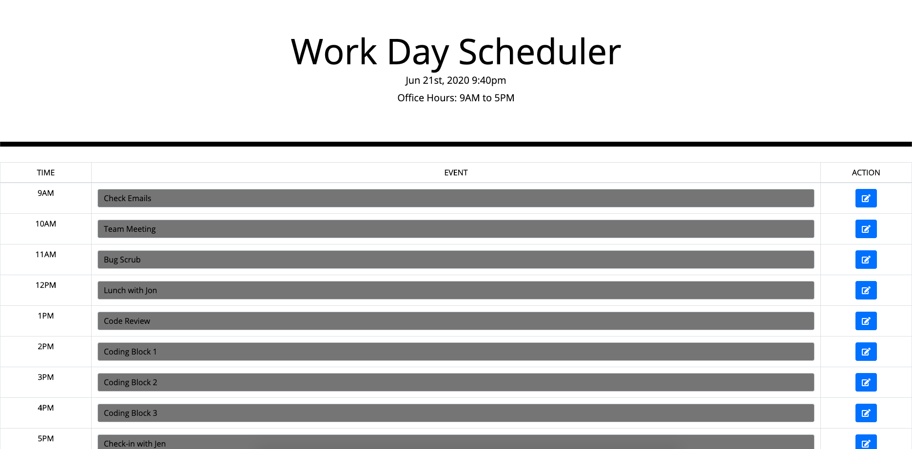
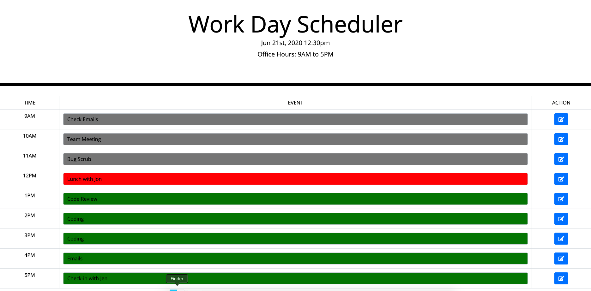

# **Work Day Scheduler**

## **Purpose**
Work Day Scheduler Webpage that uses JQUERY, css and html to provide users with 1 hour slots to schedule tasks/events.

Webpage will obtain date and time and highlight - 
* Event  that are in the past Grey
* Events that are currently underway Green
* Events that are in the future Red

Webpage will also maintain a localstorage and will be persistent across refreshes; event changes or new events can be made by -
* Clicking on the EVENT cell, updating cell.
* Clicking on the save button in the ACTION cell.

## **Technologies Used**
* JQUERY
* CSS
* HTML

## **URL**
https://sparshpatwa.github.io/ucb-05/

## **Screenshots**

## **Status**
Deployed using GITHUB
* TODO: Improve UI using CSS styling
